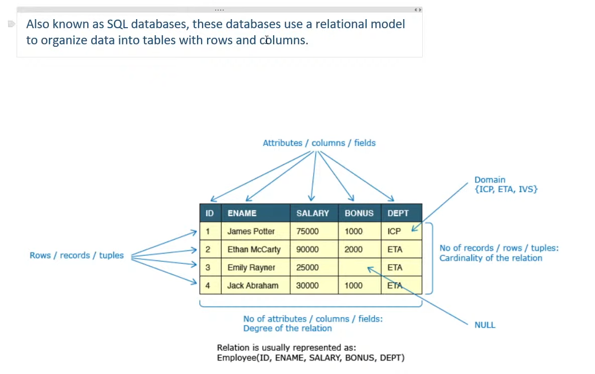
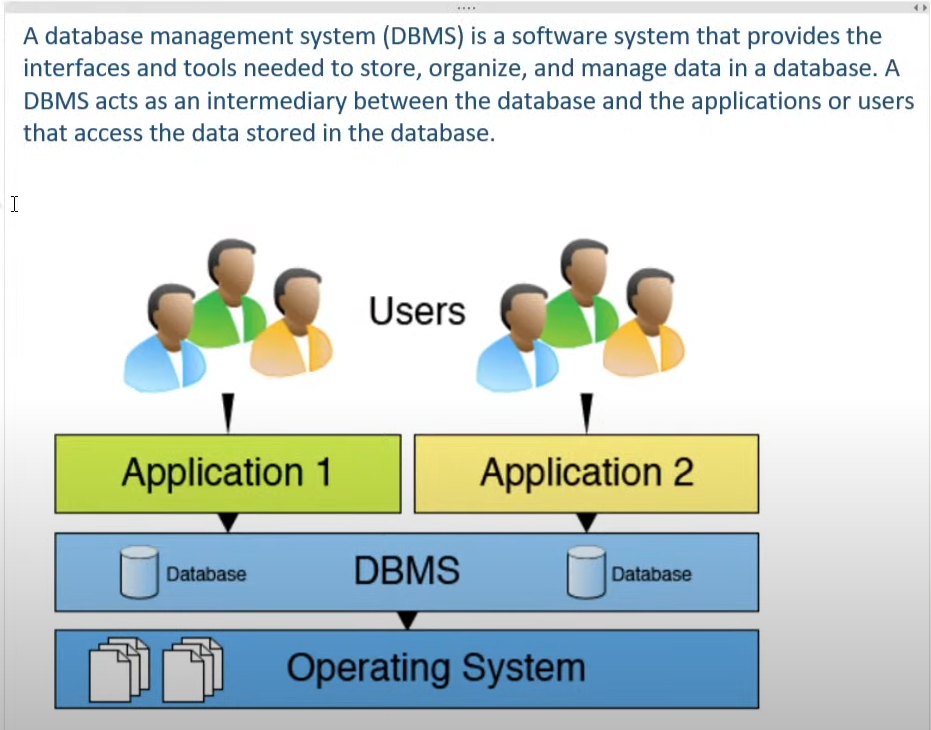

**1. What are Databases?**  
---

A database is a shared collection of logically related data and the description of this data, designed to meet the information needs of an organization.

- **Data Storage:** A database is used to store large amounts of structured data, making it easily accessible, searchable, and retrievable.
- **Data Analysis:** A database can be used to perform complex data analysis, generate reports, and provide insights into the data.
- **Record Keeping:** A database is often used to keep track of important records, such as financial transactions, customer information, and inventory levels.
- **Web Applications:** Databases are an essential component of many web applications, providing dynamic content and user management.

**2. Properties of an Ideal Database**  
---

1. **Integrity:** Ensures the accuracy and consistency of data.
2. **Availability:** The database should be available whenever needed, minimizing downtime.
3. **Security:** Protects the data from unauthorized access and ensures data privacy.
4. **Independent of Application:** The database should operate independently of the application, allowing flexibility in application design.
5. **Concurrency:** Supports multiple users and processes accessing the data simultaneously without conflicts.

**3. Types of Databases**
---

1. **Relational Databases:**  
   Also known as SQL databases, these databases use a relational model to organize data into tables with rows and columns.  
   *Examples: MySQL, PostgreSQL.*

2. **NoSQL Databases:**  
   Designed to handle large amounts of unstructured or semi-structured data, such as documents, images, or videos.  
   *Examples: MongoDB.*

3. **Column Databases:**  
   These databases store data in columns rather than rows, making them well-suited for data warehousing and analytical applications.  
   *Examples: Amazon Redshift, Google BigQuery.*

4. **Graph Databases:**  
   Used to store and query graph-structured data, such as social network connections or recommendation systems.  
   *Examples: Neo4j, Amazon Neptune.*

5. **Key-value Databases:**  
   These databases store data as a collection of keys and values, making them well-suited for caching and simple data storage needs.  
   *Examples: Redis, Amazon DynamoDB.*

**4. Comparison of Row-oriented and Column-oriented Databases**

| **Feature**                     | **Row-oriented Databases**                                                           | **Column-oriented Databases**                                                                           |
|----------------------------------|--------------------------------------------------------------------------------------|---------------------------------------------------------------------------------------------------------|
| **Data Organization**            | Organizes data by record                                                             | Organizes data by field                                                                                  |
| **Write Optimization**           | Optimized for quick data writing                                                     | Optimized for efficient column querying and computation                                                  |
| **Use Case**                     | Ideal for Online Transactional Processing (OLTP) applications with frequent writes    | Excel in Online Analytical Processing (OLAP) for ad hoc data querying                                    |
| **Memory Usage**                 | Can require extra memory when performing aggregations                                | Minimizes extra memory used and reduces number of disks accessed                                         |
| **Data Encoding & Compression**  | Uses encoding techniques and compression to improve performance                      | Utilizes advanced encoding techniques, such as Run-length encoding, and data compression                 |
| **Data Warehouses**              | Not primarily designed for data warehousing                                          | Ideal for data warehousing and business intelligence applications                                        |
| **Examples**                     | Traditional Database Management Systems (e.g., MySQL, PostgreSQL, Oracle)            | Modern cloud data warehouses (e.g., Amazon Redshift, Google BigQuery, Snowflake)                         |
| **Dominant Architecture**        | Common in relational databases for OLTP workloads                                     | Dominant architecture in relational databases for OLAP and modern cloud data warehouses                  |

